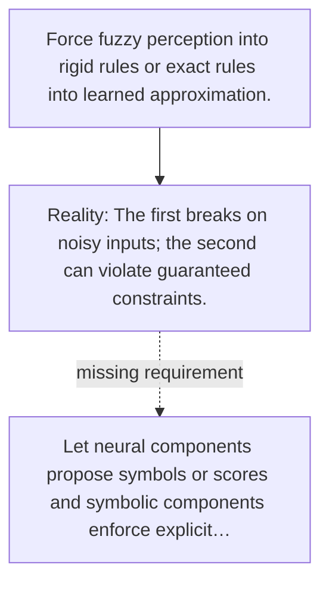

# Diagram — Excavation 117 — Neuro-Symbolic Systems

The picture carries this excavation's particular counterexample and repair.



```text
TRY     Force fuzzy perception into rigid rules or exact rules into learned approximation.
BREAK   The first breaks on noisy inputs; the second can violate guaranteed constraints.
REPAIR  Let neural components propose symbols or scores and symbolic components enforce explicit…
```
