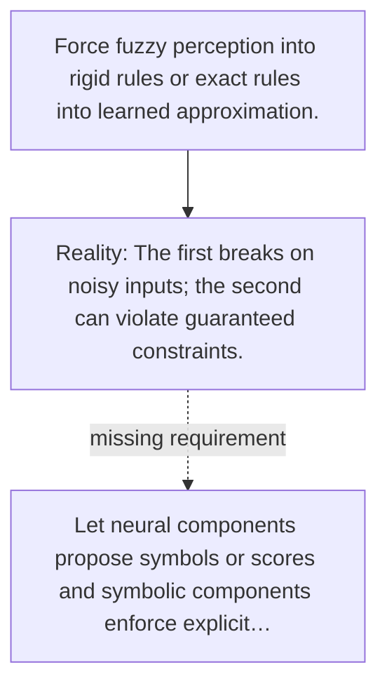

# Diagram — Excavation 117 — Neuro-Symbolic Systems

The picture carries this excavation's particular counterexample and repair.



```text
TRY     Force fuzzy perception into rigid rules or exact rules into learned approximation.
BREAK   The first breaks on noisy inputs; the second can violate guaranteed constraints.
REPAIR  Let neural components propose symbols or scores and symbolic components enforce explicit…
```

<!-- memory-film-v1:start -->
## Five-frame memory film

```text
QUESTION       What fails if we force fuzzy perception into rigid rules or exact rules into learned approximation?
     ↓
OBJECT         the neuro-symbolic systems bridge mounted on the table of mirrored maps
     ↓
VISIBLE BREAK  The bridge follows the tempting path—force fuzzy perception into rigid rules or exact rules into learned approximation. Then the evidence answers: the trouble appears immediately: the first breaks on noisy inputs; the second can violate guaranteed constraints.
     ↓
TRANSFORMATION The keeper of unfinished questions changes one moving part. The bridge can now let neural components propose symbols or scores and symbolic components enforce explicit relations.
     ↓
MEMORY SEAL    Neuro-Symbolic Systems keeps the missing power: let neural components propose symbols or scores and symbolic components enforce explicit relations.
```
<!-- memory-film-v1:end -->
