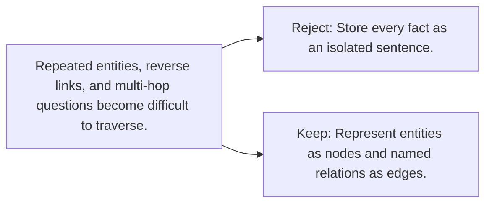

# Diagram — Excavation 118 — Knowledge Graphs

The picture carries this excavation's particular counterexample and repair.



```text
TRY     Store every fact as an isolated sentence.
BREAK   Repeated entities, reverse links, and multi-hop questions become difficult to traverse.
REPAIR  Represent entities as nodes and named relations as edges.
```

<!-- memory-film-v1:start -->
## Five-frame memory film

```text
QUESTION       What fails if we store every fact as an isolated sentence?
     ↓
OBJECT         the knowledge graphs thread mounted on the table of mirrored maps
     ↓
VISIBLE BREAK  The thread follows the tempting path—store every fact as an isolated sentence. Then the evidence answers: repeated entities, reverse links, and multi-hop questions become difficult to traverse.
     ↓
TRANSFORMATION The keeper of unfinished questions changes one moving part. The thread can now represent entities as nodes and named relations as edges.
     ↓
MEMORY SEAL    Knowledge Graphs keeps the missing power: represent entities as nodes and named relations as edges.
```
<!-- memory-film-v1:end -->
