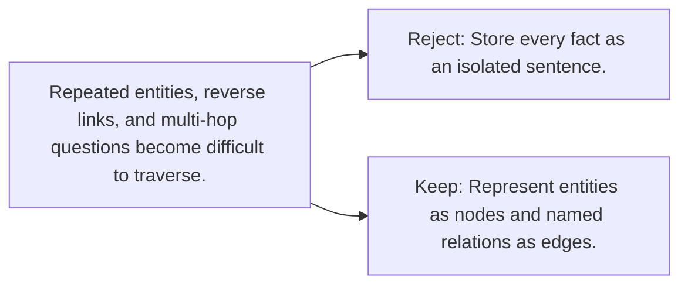

# Diagram — Excavation 118 — Knowledge Graphs

The picture carries this excavation's particular counterexample and repair.



```text
TRY     Store every fact as an isolated sentence.
BREAK   Repeated entities, reverse links, and multi-hop questions become difficult to traverse.
REPAIR  Represent entities as nodes and named relations as edges.
```
