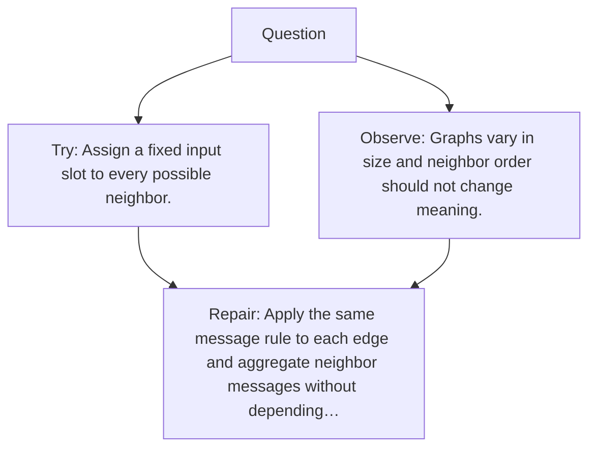

# Diagram — Excavation 119 — Graph Neural Networks

The picture carries this excavation's particular counterexample and repair.



```text
TRY     Assign a fixed input slot to every possible neighbor.
BREAK   Graphs vary in size and neighbor order should not change meaning.
REPAIR  Apply the same message rule to each edge and aggregate neighbor messages without depending…
```

<!-- memory-film-v1:start -->
## Five-frame memory film

```text
QUESTION       What fails if we assign a fixed input slot to every possible neighbor?
     ↓
OBJECT         the graph neural networks mirror mounted on the table of mirrored maps
     ↓
VISIBLE BREAK  The mirror follows the tempting path—assign a fixed input slot to every possible neighbor. Then the evidence answers: graphs vary in size and neighbor order should not change meaning.
     ↓
TRANSFORMATION The keeper of unfinished questions changes one moving part. The mirror can now apply the same message rule to each edge and aggregate neighbor messages without depending on order.
     ↓
MEMORY SEAL    Graph Neural Networks keeps the missing power: apply the same message rule to each edge and aggregate neighbor messages without depending on order.
```
<!-- memory-film-v1:end -->
