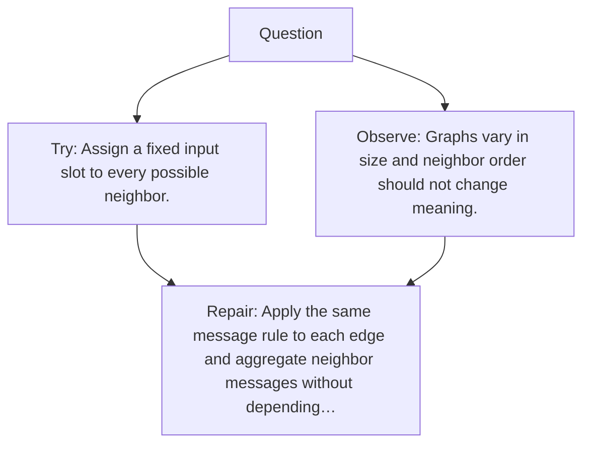

# Diagram — Excavation 119 — Graph Neural Networks

The picture carries this excavation's particular counterexample and repair.



```text
TRY     Assign a fixed input slot to every possible neighbor.
BREAK   Graphs vary in size and neighbor order should not change meaning.
REPAIR  Apply the same message rule to each edge and aggregate neighbor messages without depending…
```
