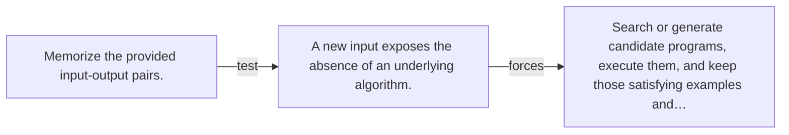

# Diagram — Excavation 120 — Program Synthesis

The picture carries this excavation's particular counterexample and repair.



```text
TRY     Memorize the provided input-output pairs.
BREAK   A new input exposes the absence of an underlying algorithm.
REPAIR  Search or generate candidate programs, execute them, and keep those satisfying examples and…
```

<!-- memory-film-v1:start -->
## Five-frame memory film

```text
QUESTION       What fails if we memorize the provided input-output pairs?
     ↓
OBJECT         the program synthesis bell mounted on the table of mirrored maps
     ↓
VISIBLE BREAK  The bell follows the tempting path—memorize the provided input-output pairs. Then the evidence answers: a new input exposes the absence of an underlying algorithm.
     ↓
TRANSFORMATION The keeper of unfinished questions changes one moving part. The bell can now search or generate candidate programs, execute them, and keep those satisfying examples and constraints.
     ↓
MEMORY SEAL    Program Synthesis keeps the missing power: search or generate candidate programs, execute them, and keep those satisfying examples and constraints.
```
<!-- memory-film-v1:end -->
