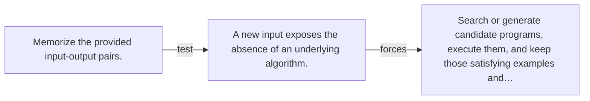

# Diagram — Excavation 120 — Program Synthesis

The picture carries this excavation's particular counterexample and repair.



```text
TRY     Memorize the provided input-output pairs.
BREAK   A new input exposes the absence of an underlying algorithm.
REPAIR  Search or generate candidate programs, execute them, and keep those satisfying examples and…
```
