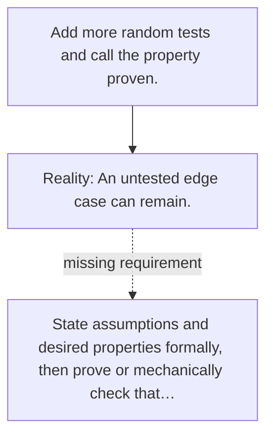

# Diagram — Excavation 121 — Formal Verification

The picture carries this excavation's particular counterexample and repair.



```text
TRY     Add more random tests and call the property proven.
BREAK   An untested edge case can remain.
REPAIR  State assumptions and desired properties formally, then prove or mechanically check that…
```

<!-- memory-film-v1:start -->
## Five-frame memory film

```text
QUESTION       What fails if we add more random tests and call the property proven?
     ↓
OBJECT         the formal verification vessel mounted on the table of mirrored maps
     ↓
VISIBLE BREAK  The vessel follows the tempting path—add more random tests and call the property proven. Then the evidence answers: an untested edge case can remain.
     ↓
TRANSFORMATION The keeper of unfinished questions changes one moving part. The vessel can now state assumptions and desired properties formally, then prove or mechanically check that every transition preserves them.
     ↓
MEMORY SEAL    Formal Verification keeps the missing power: state assumptions and desired properties formally, then prove or mechanically check that every transition preserves them.
```
<!-- memory-film-v1:end -->
