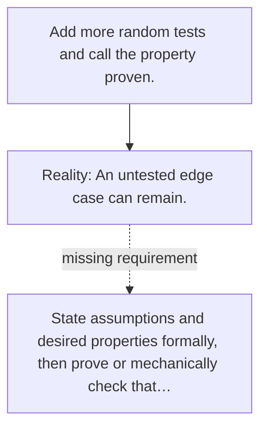

# Diagram — Excavation 121 — Formal Verification

The picture carries this excavation's particular counterexample and repair.



```text
TRY     Add more random tests and call the property proven.
BREAK   An untested edge case can remain.
REPAIR  State assumptions and desired properties formally, then prove or mechanically check that…
```
