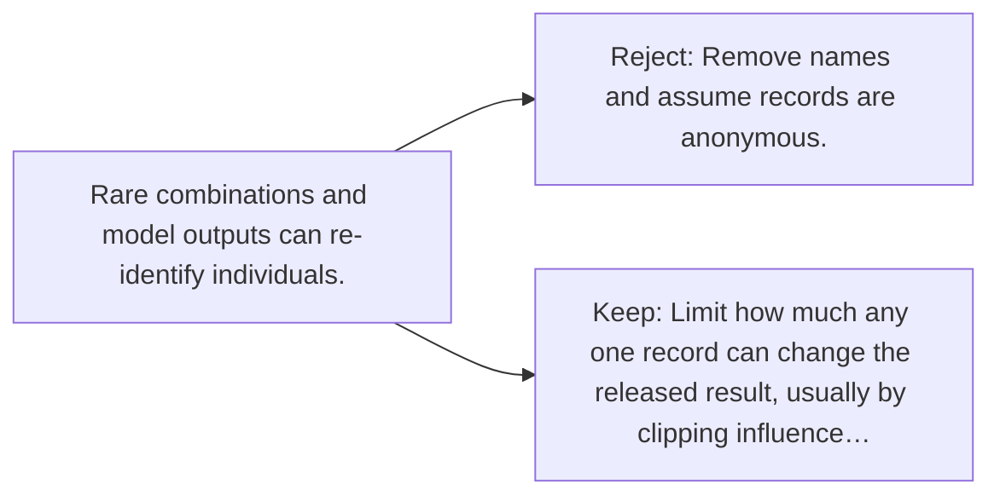

# Diagram — Excavation 122 — Differential Privacy

The picture carries this excavation's particular counterexample and repair.



```text
TRY     Remove names and assume records are anonymous.
BREAK   Rare combinations and model outputs can re-identify individuals.
REPAIR  Limit how much any one record can change the released result, usually by clipping influence…
```
