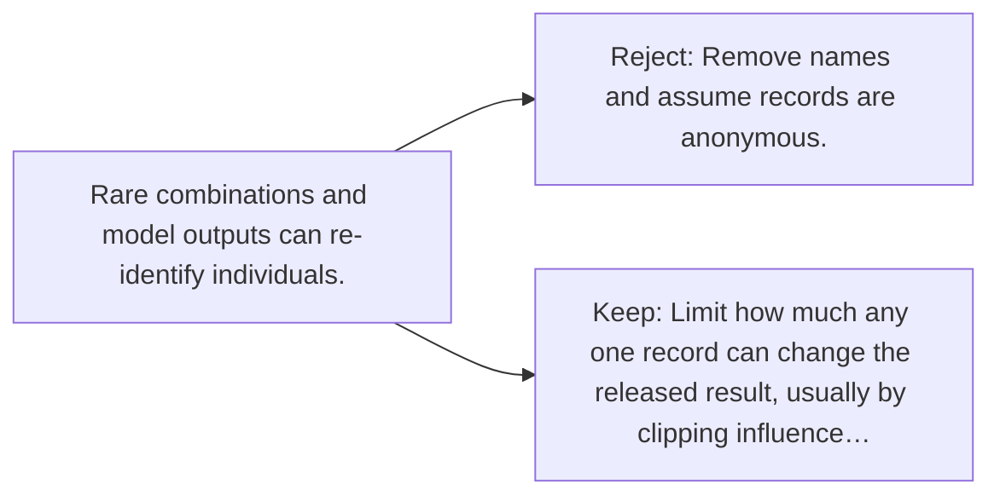

# Diagram — Excavation 122 — Differential Privacy

The picture carries this excavation's particular counterexample and repair.



```text
TRY     Remove names and assume records are anonymous.
BREAK   Rare combinations and model outputs can re-identify individuals.
REPAIR  Limit how much any one record can change the released result, usually by clipping influence…
```

<!-- memory-film-v1:start -->
## Five-frame memory film

```text
QUESTION       What fails if we remove names and assume records are anonymous?
     ↓
OBJECT         the differential privacy gate mounted on the table of mirrored maps
     ↓
VISIBLE BREAK  The gate follows the tempting path—remove names and assume records are anonymous. Then the evidence answers: the trouble appears immediately: rare combinations and model outputs can re-identify individuals.
     ↓
TRANSFORMATION The keeper of unfinished questions changes one moving part. The gate can now limit how much any one record can change the released result, usually by clipping influence and adding calibrated noise.
     ↓
MEMORY SEAL    Differential Privacy keeps the missing power: limit how much any one record can change the released result, usually by clipping influence and adding calibrated noise.
```
<!-- memory-film-v1:end -->
