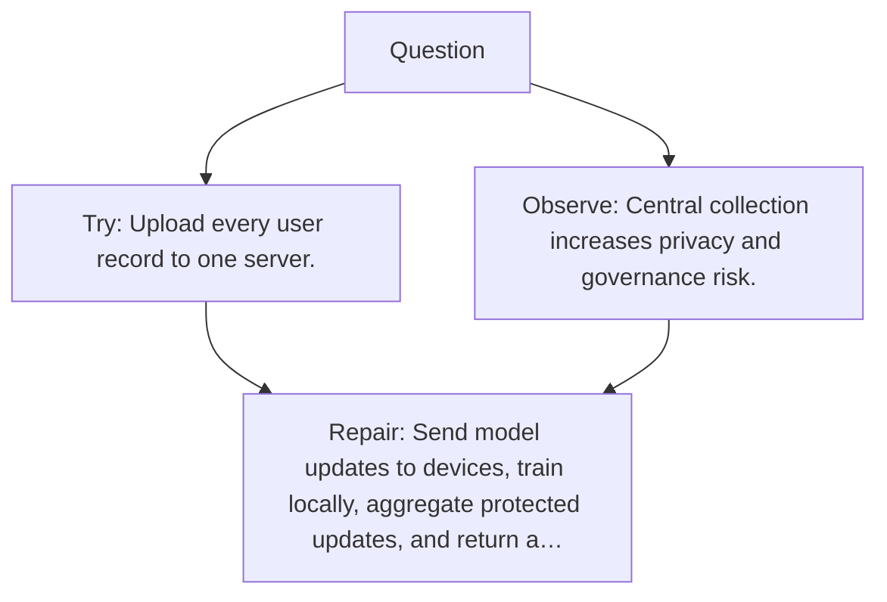

# Diagram — Excavation 123 — Federated Learning

The picture carries this excavation's particular counterexample and repair.



```text
TRY     Upload every user record to one server.
BREAK   Central collection increases privacy and governance risk.
REPAIR  Send model updates to devices, train locally, aggregate protected updates, and return a…
```

<!-- memory-film-v1:start -->
## Five-frame memory film

```text
QUESTION       What fails if we upload every user record to one server?
     ↓
OBJECT         the federated learning wheel mounted on the table of mirrored maps
     ↓
VISIBLE BREAK  The wheel follows the tempting path—upload every user record to one server. Then the evidence answers: central collection increases privacy and governance risk.
     ↓
TRANSFORMATION The keeper of unfinished questions changes one moving part. The wheel can now send model updates to devices, train locally, aggregate protected updates, and return a shared model.
     ↓
MEMORY SEAL    Federated Learning keeps the missing power: send model updates to devices, train locally, aggregate protected updates, and return a shared model.
```
<!-- memory-film-v1:end -->
