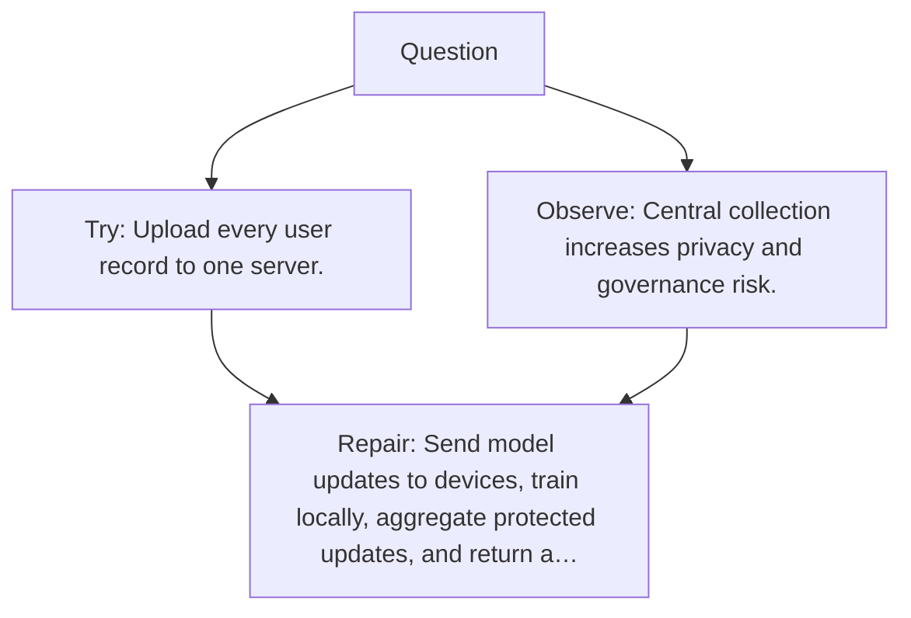

# Diagram — Excavation 123 — Federated Learning

The picture carries this excavation's particular counterexample and repair.



```text
TRY     Upload every user record to one server.
BREAK   Central collection increases privacy and governance risk.
REPAIR  Send model updates to devices, train locally, aggregate protected updates, and return a…
```
