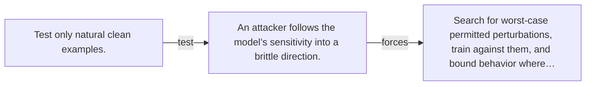

# Diagram — Excavation 124 — Adversarial Robustness

The picture carries this excavation's particular counterexample and repair.



```text
TRY     Test only natural clean examples.
BREAK   An attacker follows the model’s sensitivity into a brittle direction.
REPAIR  Search for worst-case permitted perturbations, train against them, and bound behavior where…
```
