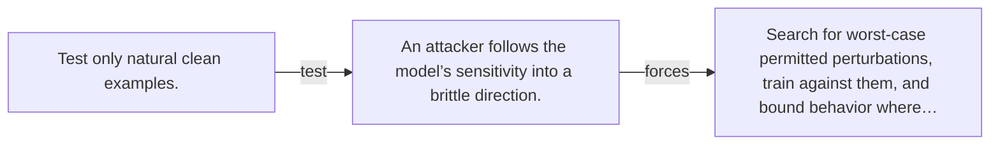

# Diagram — Excavation 124 — Adversarial Robustness

The picture carries this excavation's particular counterexample and repair.



```text
TRY     Test only natural clean examples.
BREAK   An attacker follows the model’s sensitivity into a brittle direction.
REPAIR  Search for worst-case permitted perturbations, train against them, and bound behavior where…
```

<!-- memory-film-v1:start -->
## Five-frame memory film

```text
QUESTION       What fails if we test only natural clean examples?
     ↓
OBJECT         the adversarial robustness map mounted on the table of mirrored maps
     ↓
VISIBLE BREAK  The map follows the tempting path—test only natural clean examples. Then the evidence answers: an attacker follows the model’s sensitivity into a brittle direction.
     ↓
TRANSFORMATION The keeper of unfinished questions changes one moving part. The map can now search for worst-case permitted perturbations, train against them, and bound behavior where possible.
     ↓
MEMORY SEAL    Adversarial Robustness keeps the missing power: search for worst-case permitted perturbations, train against them, and bound behavior where possible.
```
<!-- memory-film-v1:end -->
