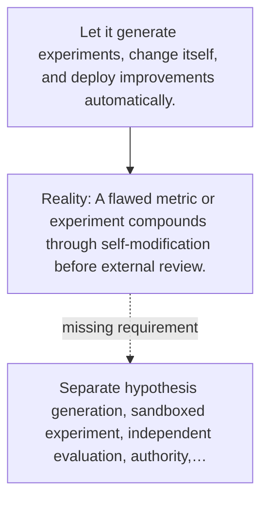

# Diagram — Excavation 125 — An Open-Ended Research System

The picture carries this excavation's particular counterexample and repair.



```text
TRY     Let it generate experiments, change itself, and deploy improvements automatically.
BREAK   A flawed metric or experiment compounds through self-modification before external review.
REPAIR  Separate hypothesis generation, sandboxed experiment, independent evaluation, authority,…
```
