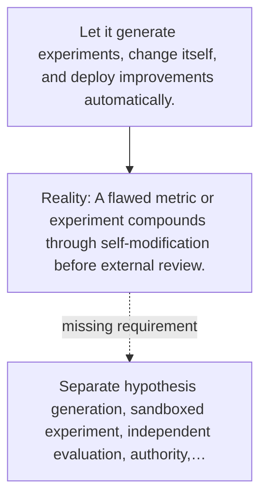

# Diagram — Excavation 125 — An Open-Ended Research System

The picture carries this excavation's particular counterexample and repair.



```text
TRY     Let it generate experiments, change itself, and deploy improvements automatically.
BREAK   A flawed metric or experiment compounds through self-modification before external review.
REPAIR  Separate hypothesis generation, sandboxed experiment, independent evaluation, authority,…
```

<!-- memory-film-v1:start -->
## Five-frame memory film

```text
QUESTION       What fails if we let it generate experiments, change itself, and deploy improvements automatically?
     ↓
OBJECT         the open-ended research system scale mounted on the table of mirrored maps
     ↓
VISIBLE BREAK  The scale follows the tempting path—let it generate experiments, change itself, and deploy improvements automatically. Then the evidence answers: a flawed metric or experiment compounds through self-modification before external review.
     ↓
TRANSFORMATION The keeper of unfinished questions changes one moving part. The scale can now separate hypothesis generation, sandboxed experiment, independent evaluation, authority, reproducibility, and approved deployment.
     ↓
MEMORY SEAL    An Open-Ended Research System keeps the missing power: separate hypothesis generation, sandboxed experiment, independent evaluation, authority, reproducibility, and approved deployment.
```
<!-- memory-film-v1:end -->
