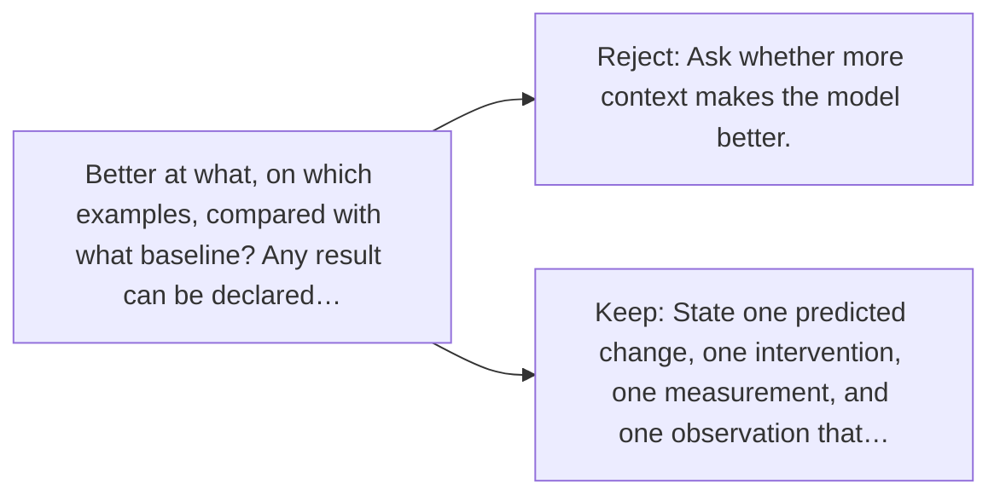

# Diagram — Excavation 126 — Hypotheses — Turning Curiosity into a Testable Claim

The picture carries this excavation's particular counterexample and repair.



```text
TRY     Ask whether more context makes the model better.
BREAK   Better at what, on which examples, compared with what baseline? Any result can be declared…
REPAIR  State one predicted change, one intervention, one measurement, and one observation that…
```
