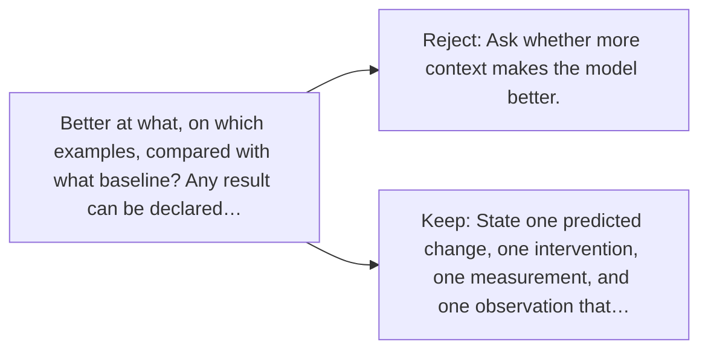

# Diagram — Excavation 126 — Hypotheses — Turning Curiosity into a Testable Claim

The picture carries this excavation's particular counterexample and repair.



```text
TRY     Ask whether more context makes the model better.
BREAK   Better at what, on which examples, compared with what baseline? Any result can be declared…
REPAIR  State one predicted change, one intervention, one measurement, and one observation that…
```

<!-- memory-film-v1:start -->
## Five-frame memory film

```text
QUESTION       What fails if we ask whether more context makes the model better?
     ↓
OBJECT         the hypotheses gear mounted on the sealed evidence ledger
     ↓
VISIBLE BREAK  The gear follows the tempting path—ask whether more context makes the model better. Then the evidence answers: better at what, on which examples, compared with what baseline? Any result can be declared a success after the fact.
     ↓
TRANSFORMATION The experimentalist changes one moving part. The gear can now state one predicted change, one intervention, one measurement, and one observation that would count against the claim.
     ↓
MEMORY SEAL    Hypotheses keeps the missing power: state one predicted change, one intervention, one measurement, and one observation that would count against the claim.
```
<!-- memory-film-v1:end -->
