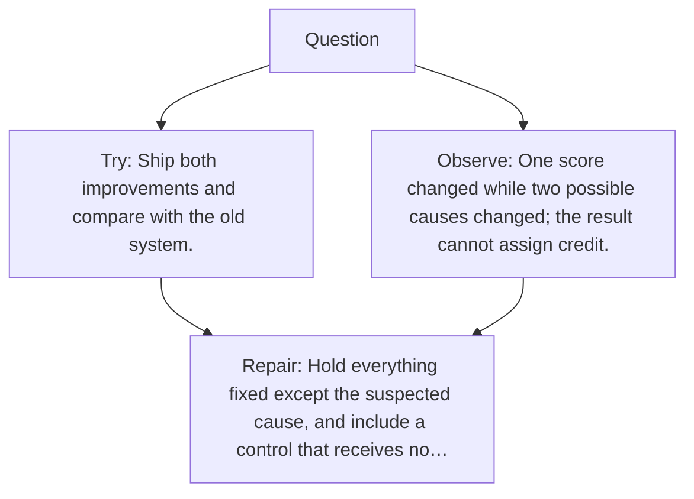

# Diagram — Excavation 127 — Experimental Design — Changing One Cause at a Time

The picture carries this excavation's particular counterexample and repair.



```text
TRY     Ship both improvements and compare with the old system.
BREAK   One score changed while two possible causes changed; the result cannot assign credit.
REPAIR  Hold everything fixed except the suspected cause, and include a control that receives no…
```

<!-- memory-film-v1:start -->
## Five-frame memory film

```text
QUESTION       What fails if we ship both improvements and compare with the old system?
     ↓
OBJECT         the experimental design prism mounted on the sealed evidence ledger
     ↓
VISIBLE BREAK  The prism follows the tempting path—ship both improvements and compare with the old system. Then the evidence answers: the trouble appears immediately: one score changed while two possible causes changed; the result cannot assign credit.
     ↓
TRANSFORMATION The experimentalist changes one moving part. The prism can now hold everything fixed except the suspected cause, and include a control that receives no intervention.
     ↓
MEMORY SEAL    Experimental Design keeps the missing power: hold everything fixed except the suspected cause, and include a control that receives no intervention.
```
<!-- memory-film-v1:end -->
