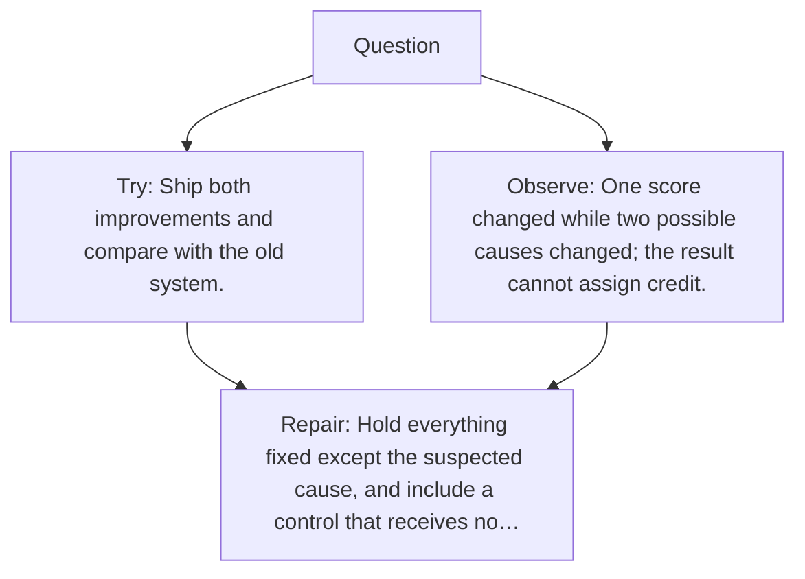

# Diagram — Excavation 127 — Experimental Design — Changing One Cause at a Time

The picture carries this excavation's particular counterexample and repair.



```text
TRY     Ship both improvements and compare with the old system.
BREAK   One score changed while two possible causes changed; the result cannot assign credit.
REPAIR  Hold everything fixed except the suspected cause, and include a control that receives no…
```
