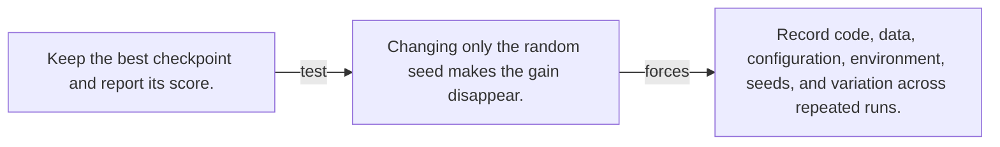

# Diagram — Excavation 128 — Reproducibility — Can the Discovery Survive Another Run?

The picture carries this excavation's particular counterexample and repair.



```text
TRY     Keep the best checkpoint and report its score.
BREAK   Changing only the random seed makes the gain disappear.
REPAIR  Record code, data, configuration, environment, seeds, and variation across repeated runs.
```
