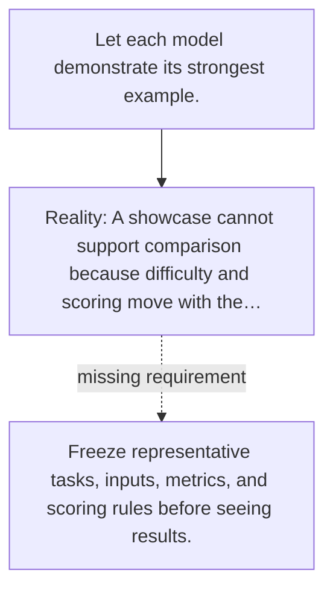

# Diagram — Excavation 129 — Benchmarks — Building a Ruler Before Measuring Progress

The picture carries this excavation's particular counterexample and repair.



```text
TRY     Let each model demonstrate its strongest example.
BREAK   A showcase cannot support comparison because difficulty and scoring move with the…
REPAIR  Freeze representative tasks, inputs, metrics, and scoring rules before seeing results.
```
