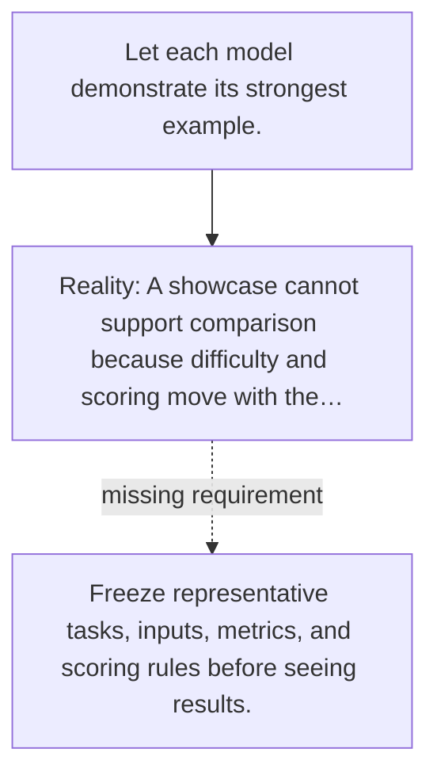

# Diagram — Excavation 129 — Benchmarks — Building a Ruler Before Measuring Progress

The picture carries this excavation's particular counterexample and repair.



```text
TRY     Let each model demonstrate its strongest example.
BREAK   A showcase cannot support comparison because difficulty and scoring move with the…
REPAIR  Freeze representative tasks, inputs, metrics, and scoring rules before seeing results.
```

<!-- memory-film-v1:start -->
## Five-frame memory film

```text
QUESTION       What fails if we let each model demonstrate its strongest example?
     ↓
OBJECT         the benchmarks lens mounted on the sealed evidence ledger
     ↓
VISIBLE BREAK  The lens follows the tempting path—let each model demonstrate its strongest example. Then the evidence answers: a showcase cannot support comparison because difficulty and scoring move with the contestant.
     ↓
TRANSFORMATION The experimentalist changes one moving part. The lens can now freeze representative tasks, inputs, metrics, and scoring rules before seeing results.
     ↓
MEMORY SEAL    Benchmarks keeps the missing power: freeze representative tasks, inputs, metrics, and scoring rules before seeing results.
```
<!-- memory-film-v1:end -->
