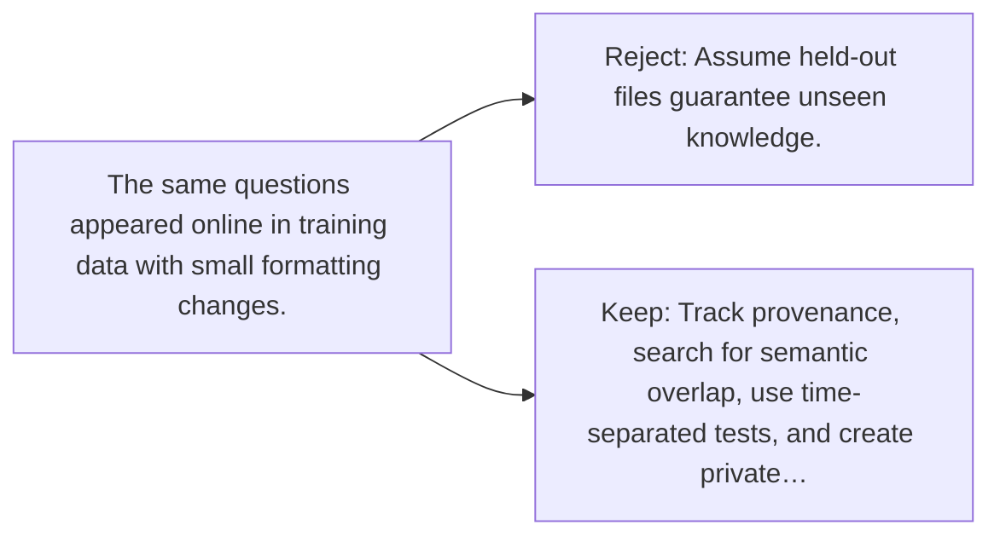

# Diagram — Excavation 130 — Data Contamination — When the Test Was Secretly Homework

The picture carries this excavation's particular counterexample and repair.



```text
TRY     Assume held-out files guarantee unseen knowledge.
BREAK   The same questions appeared online in training data with small formatting changes.
REPAIR  Track provenance, search for semantic overlap, use time-separated tests, and create private…
```
