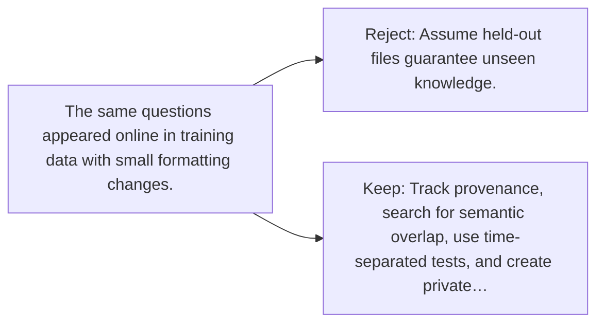

# Diagram — Excavation 130 — Data Contamination — When the Test Was Secretly Homework

The picture carries this excavation's particular counterexample and repair.



```text
TRY     Assume held-out files guarantee unseen knowledge.
BREAK   The same questions appeared online in training data with small formatting changes.
REPAIR  Track provenance, search for semantic overlap, use time-separated tests, and create private…
```

<!-- memory-film-v1:start -->
## Five-frame memory film

```text
QUESTION       When the Test Was Secretly Homework?
     ↓
OBJECT         the data contamination key mounted on the sealed evidence ledger
     ↓
VISIBLE BREAK  The key follows the tempting path—assume held-out files guarantee unseen knowledge. Then the evidence answers: the same questions appeared online in training data with small formatting changes.
     ↓
TRANSFORMATION The experimentalist changes one moving part. The key can now track provenance, search for semantic overlap, use time-separated tests, and create private fresh evaluations.
     ↓
MEMORY SEAL    Data Contamination keeps the missing power: track provenance, search for semantic overlap, use time-separated tests, and create private fresh evaluations.
```
<!-- memory-film-v1:end -->
