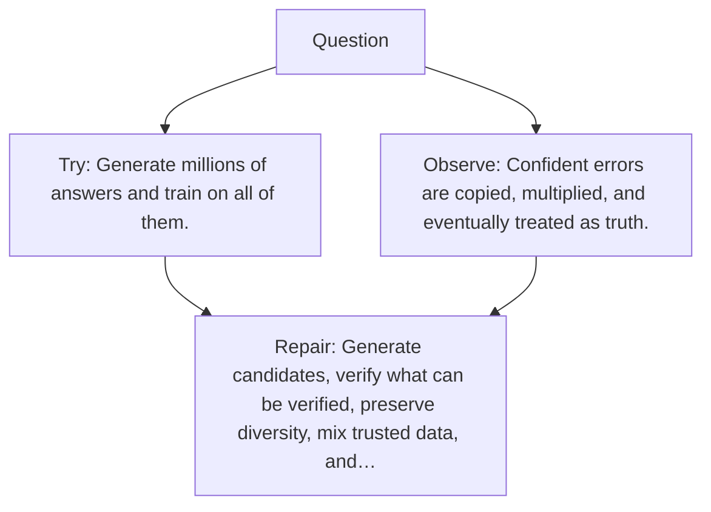

# Diagram — Excavation 131 — Synthetic Data — Letting a Model Write Lessons

The picture carries this excavation's particular counterexample and repair.



```text
TRY     Generate millions of answers and train on all of them.
BREAK   Confident errors are copied, multiplied, and eventually treated as truth.
REPAIR  Generate candidates, verify what can be verified, preserve diversity, mix trusted data, and…
```
