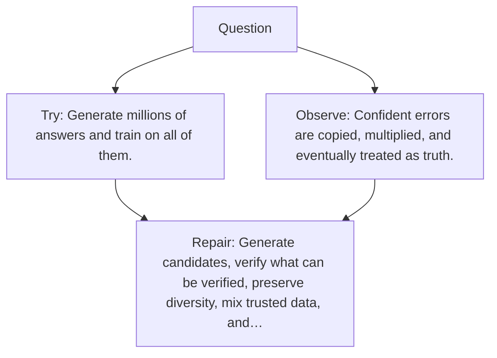

# Diagram — Excavation 131 — Synthetic Data — Letting a Model Write Lessons

The picture carries this excavation's particular counterexample and repair.



```text
TRY     Generate millions of answers and train on all of them.
BREAK   Confident errors are copied, multiplied, and eventually treated as truth.
REPAIR  Generate candidates, verify what can be verified, preserve diversity, mix trusted data, and…
```

<!-- memory-film-v1:start -->
## Five-frame memory film

```text
QUESTION       What fails if we generate millions of answers and train on all of them?
     ↓
OBJECT         the synthetic data lantern mounted on the sealed evidence ledger
     ↓
VISIBLE BREAK  The lantern follows the tempting path—generate millions of answers and train on all of them. Then the evidence answers: confident errors are copied, multiplied, and eventually treated as truth.
     ↓
TRANSFORMATION The experimentalist changes one moving part. The lantern can now generate candidates, verify what can be verified, preserve diversity, mix trusted data, and track ancestry.
     ↓
MEMORY SEAL    Synthetic Data keeps the missing power: generate candidates, verify what can be verified, preserve diversity, mix trusted data, and track ancestry.
```
<!-- memory-film-v1:end -->
