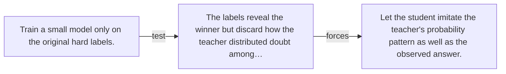

# Diagram — Excavation 132 — Knowledge Distillation — Teaching a Smaller Student

The picture carries this excavation's particular counterexample and repair.



```text
TRY     Train a small model only on the original hard labels.
BREAK   The labels reveal the winner but discard how the teacher distributed doubt among…
REPAIR  Let the student imitate the teacher's probability pattern as well as the observed answer.
```

<!-- memory-film-v1:start -->
## Five-frame memory film

```text
QUESTION       What fails if we train a small model only on the original hard labels?
     ↓
OBJECT         the knowledge distillation compass mounted on the sealed evidence ledger
     ↓
VISIBLE BREAK  The compass follows the tempting path—train a small model only on the original hard labels. Then the evidence answers: the trouble appears immediately: the labels reveal the winner but discard how the teacher distributed doubt among alternatives.
     ↓
TRANSFORMATION The experimentalist changes one moving part. The compass can now let the student imitate the teacher's probability pattern as well as the observed answer.
     ↓
MEMORY SEAL    Knowledge Distillation keeps the missing power: let the student imitate the teacher's probability pattern as well as the observed answer.
```
<!-- memory-film-v1:end -->
