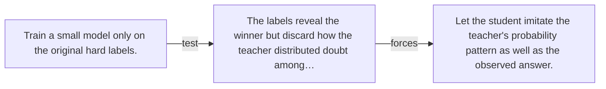

# Diagram — Excavation 132 — Knowledge Distillation — Teaching a Smaller Student

The picture carries this excavation's particular counterexample and repair.



```text
TRY     Train a small model only on the original hard labels.
BREAK   The labels reveal the winner but discard how the teacher distributed doubt among…
REPAIR  Let the student imitate the teacher's probability pattern as well as the observed answer.
```
