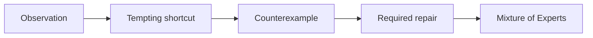

# Diagram — Mixture of Experts — Spending Computation Where It Helps


```mermaid
flowchart LR
    A["Observation"] --> B["Tempting shortcut"]
    B --> C["Counterexample"]
    C --> D["Required repair"]
    D --> E["Mixture of Experts"]
```

```text
observation -> attempt -> failure -> requirement -> discovery
```
