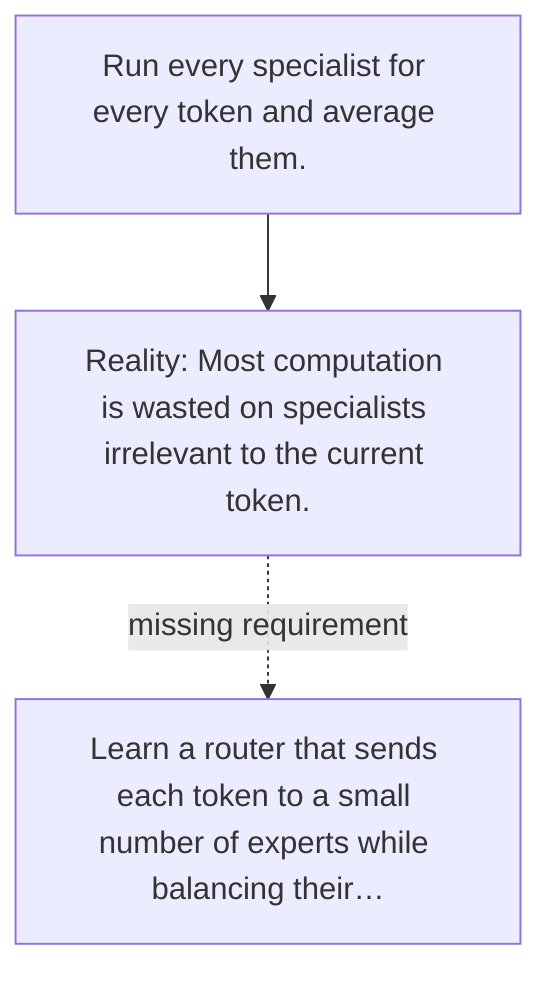

# Diagram — Excavation 133 — Mixture of Experts — Spending Computation Where It Helps

The picture carries this excavation's particular counterexample and repair.



```text
TRY     Run every specialist for every token and average them.
BREAK   Most computation is wasted on specialists irrelevant to the current token.
REPAIR  Learn a router that sends each token to a small number of experts while balancing their…
```

<!-- memory-film-v1:start -->
## Five-frame memory film

```text
QUESTION       What fails if we run every specialist for every token and average them?
     ↓
OBJECT         the mixture of experts bridge mounted on the sealed evidence ledger
     ↓
VISIBLE BREAK  The bridge follows the tempting path—run every specialist for every token and average them. Then the evidence answers: most computation is wasted on specialists irrelevant to the current token.
     ↓
TRANSFORMATION The experimentalist changes one moving part. The bridge can now learn a router that sends each token to a small number of experts while balancing their workload.
     ↓
MEMORY SEAL    Mixture of Experts keeps the missing power: learn a router that sends each token to a small number of experts while balancing their workload.
```
<!-- memory-film-v1:end -->
