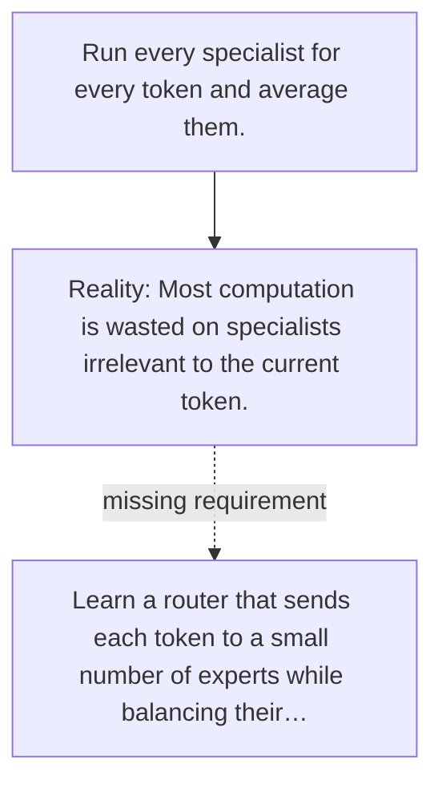

# Diagram — Excavation 133 — Mixture of Experts — Spending Computation Where It Helps

The picture carries this excavation's particular counterexample and repair.



```text
TRY     Run every specialist for every token and average them.
BREAK   Most computation is wasted on specialists irrelevant to the current token.
REPAIR  Learn a router that sends each token to a small number of experts while balancing their…
```
