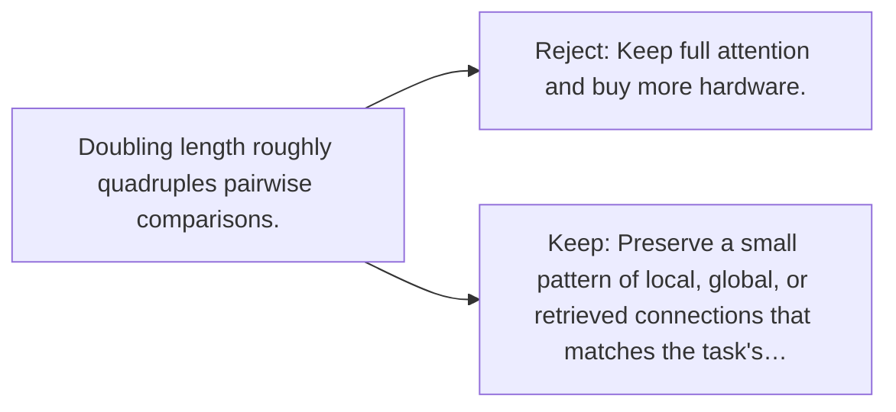

# Diagram — Excavation 134 — Sparse Attention — Looking Without Comparing Everything

The picture carries this excavation's particular counterexample and repair.



```text
TRY     Keep full attention and buy more hardware.
BREAK   Doubling length roughly quadruples pairwise comparisons.
REPAIR  Preserve a small pattern of local, global, or retrieved connections that matches the task's…
```
