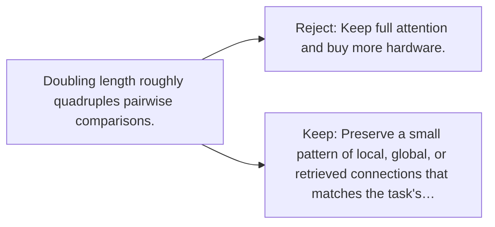

# Diagram — Excavation 134 — Sparse Attention — Looking Without Comparing Everything

The picture carries this excavation's particular counterexample and repair.



```text
TRY     Keep full attention and buy more hardware.
BREAK   Doubling length roughly quadruples pairwise comparisons.
REPAIR  Preserve a small pattern of local, global, or retrieved connections that matches the task's…
```

<!-- memory-film-v1:start -->
## Five-frame memory film

```text
QUESTION       What fails if we keep full attention and buy more hardware?
     ↓
OBJECT         the sparse attention thread mounted on the sealed evidence ledger
     ↓
VISIBLE BREAK  The thread follows the tempting path—keep full attention and buy more hardware. Then the evidence answers: doubling length roughly quadruples pairwise comparisons.
     ↓
TRANSFORMATION The experimentalist changes one moving part. The thread can now preserve a small pattern of local, global, or retrieved connections that matches the task's information paths.
     ↓
MEMORY SEAL    Sparse Attention keeps the missing power: preserve a small pattern of local, global, or retrieved connections that matches the task's information paths.
```
<!-- memory-film-v1:end -->
