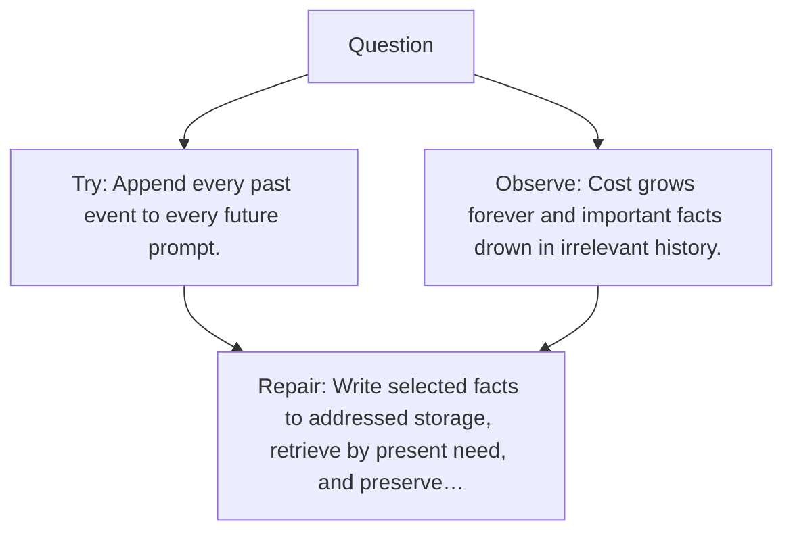

# Diagram — Excavation 135 — External Memory — Remembering Beyond the Context Window

The picture carries this excavation's particular counterexample and repair.



```text
TRY     Append every past event to every future prompt.
BREAK   Cost grows forever and important facts drown in irrelevant history.
REPAIR  Write selected facts to addressed storage, retrieve by present need, and preserve…
```
