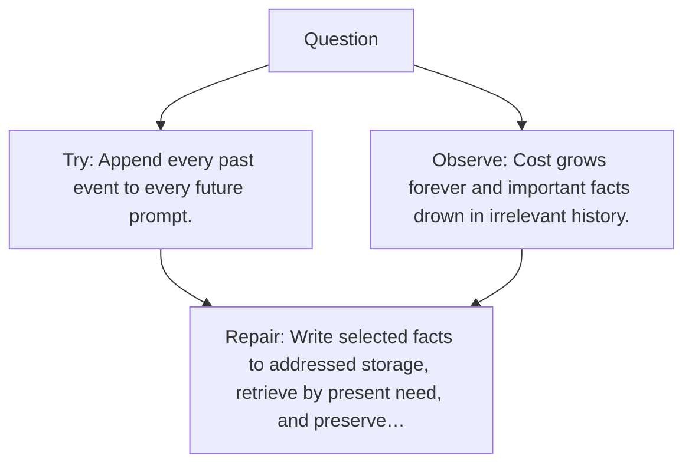

# Diagram — Excavation 135 — External Memory — Remembering Beyond the Context Window

The picture carries this excavation's particular counterexample and repair.



```text
TRY     Append every past event to every future prompt.
BREAK   Cost grows forever and important facts drown in irrelevant history.
REPAIR  Write selected facts to addressed storage, retrieve by present need, and preserve…
```

<!-- memory-film-v1:start -->
## Five-frame memory film

```text
QUESTION       What fails if we append every past event to every future prompt?
     ↓
OBJECT         the external memory mirror mounted on the sealed evidence ledger
     ↓
VISIBLE BREAK  The mirror follows the tempting path—append every past event to every future prompt. Then the evidence answers: cost grows forever and important facts drown in irrelevant history.
     ↓
TRANSFORMATION The experimentalist changes one moving part. The mirror can now write selected facts to addressed storage, retrieve by present need, and preserve provenance and update rules.
     ↓
MEMORY SEAL    External Memory keeps the missing power: write selected facts to addressed storage, retrieve by present need, and preserve provenance and update rules.
```
<!-- memory-film-v1:end -->
