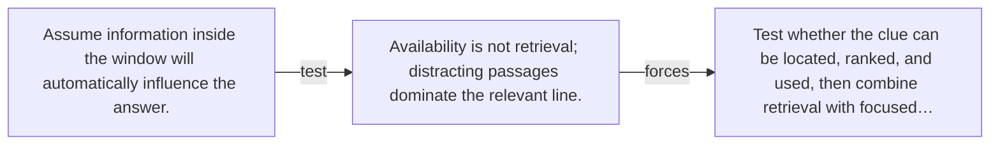

# Diagram — Excavation 136 — Long-Context Retrieval — Finding the One Clue That Matters

The picture carries this excavation's particular counterexample and repair.



```text
TRY     Assume information inside the window will automatically influence the answer.
BREAK   Availability is not retrieval; distracting passages dominate the relevant line.
REPAIR  Test whether the clue can be located, ranked, and used, then combine retrieval with focused…
```
