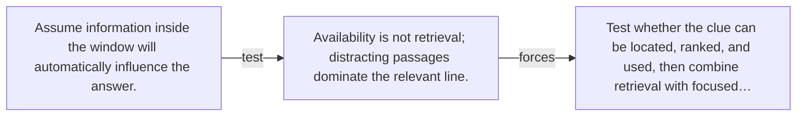

# Diagram — Excavation 136 — Long-Context Retrieval — Finding the One Clue That Matters

The picture carries this excavation's particular counterexample and repair.



```text
TRY     Assume information inside the window will automatically influence the answer.
BREAK   Availability is not retrieval; distracting passages dominate the relevant line.
REPAIR  Test whether the clue can be located, ranked, and used, then combine retrieval with focused…
```

<!-- memory-film-v1:start -->
## Five-frame memory film

```text
QUESTION       What fails if we assume information inside the window will automatically influence the answer?
     ↓
OBJECT         the long-context retrieval bell mounted on the sealed evidence ledger
     ↓
VISIBLE BREAK  The bell follows the tempting path—assume information inside the window will automatically influence the answer. Then the evidence answers: availability is not retrieval; distracting passages dominate the relevant line.
     ↓
TRANSFORMATION The experimentalist changes one moving part. The bell can now test whether the clue can be located, ranked, and used, then combine retrieval with focused reasoning.
     ↓
MEMORY SEAL    Long-Context Retrieval keeps the missing power: test whether the clue can be located, ranked, and used, then combine retrieval with focused reasoning.
```
<!-- memory-film-v1:end -->
