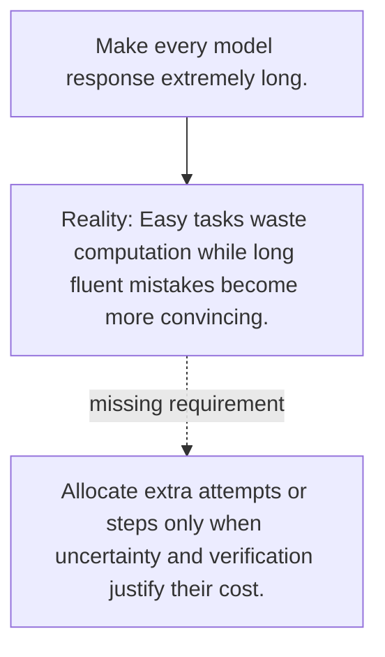

# Diagram — Excavation 137 — Test-Time Compute — Thinking Longer on Harder Problems

The picture carries this excavation's particular counterexample and repair.



```text
TRY     Make every model response extremely long.
BREAK   Easy tasks waste computation while long fluent mistakes become more convincing.
REPAIR  Allocate extra attempts or steps only when uncertainty and verification justify their cost.
```
