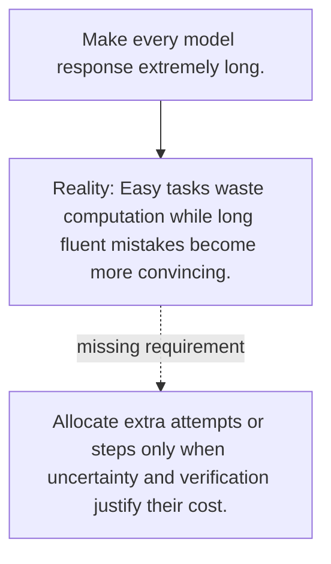

# Diagram — Excavation 137 — Test-Time Compute — Thinking Longer on Harder Problems

The picture carries this excavation's particular counterexample and repair.



```text
TRY     Make every model response extremely long.
BREAK   Easy tasks waste computation while long fluent mistakes become more convincing.
REPAIR  Allocate extra attempts or steps only when uncertainty and verification justify their cost.
```

<!-- memory-film-v1:start -->
## Five-frame memory film

```text
QUESTION       What fails if we make every model response extremely long?
     ↓
OBJECT         the test-time compute vessel mounted on the sealed evidence ledger
     ↓
VISIBLE BREAK  The vessel follows the tempting path—make every model response extremely long. Then the evidence answers: the trouble appears immediately: easy tasks waste computation while long fluent mistakes become more convincing.
     ↓
TRANSFORMATION The experimentalist changes one moving part. The vessel can now allocate extra attempts or steps only when uncertainty and verification justify their cost.
     ↓
MEMORY SEAL    Test-Time Compute keeps the missing power: allocate extra attempts or steps only when uncertainty and verification justify their cost.
```
<!-- memory-film-v1:end -->
