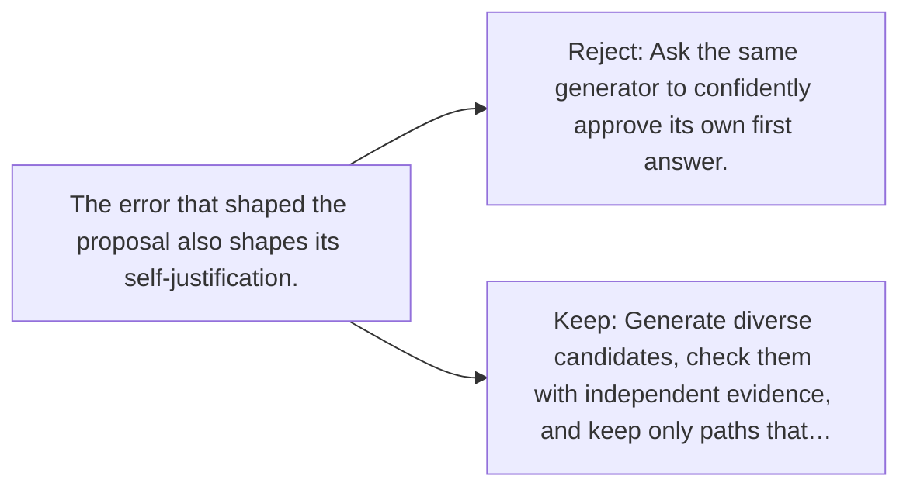

# Diagram — Excavation 138 — Search and Verification — Separate Proposing from Checking

The picture carries this excavation's particular counterexample and repair.



```text
TRY     Ask the same generator to confidently approve its own first answer.
BREAK   The error that shaped the proposal also shapes its self-justification.
REPAIR  Generate diverse candidates, check them with independent evidence, and keep only paths that…
```
