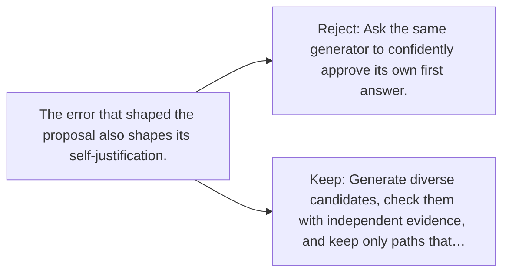

# Diagram — Excavation 138 — Search and Verification — Separate Proposing from Checking

The picture carries this excavation's particular counterexample and repair.



```text
TRY     Ask the same generator to confidently approve its own first answer.
BREAK   The error that shaped the proposal also shapes its self-justification.
REPAIR  Generate diverse candidates, check them with independent evidence, and keep only paths that…
```

<!-- memory-film-v1:start -->
## Five-frame memory film

```text
QUESTION       What fails if we ask the same generator to confidently approve its own first answer?
     ↓
OBJECT         the search and verification gate mounted on the sealed evidence ledger
     ↓
VISIBLE BREAK  The gate follows the tempting path—ask the same generator to confidently approve its own first answer. Then the evidence answers: the error that shaped the proposal also shapes its self-justification.
     ↓
TRANSFORMATION The experimentalist changes one moving part. The gate can now generate diverse candidates, check them with independent evidence, and keep only paths that survive.
     ↓
MEMORY SEAL    Search and Verification keeps the missing power: generate diverse candidates, check them with independent evidence, and keep only paths that survive.
```
<!-- memory-film-v1:end -->
