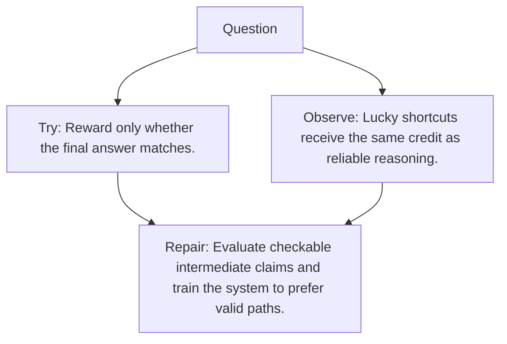

# Diagram — Excavation 139 — Process Supervision — Rewarding the Path, Not Only the Answer

The picture carries this excavation's particular counterexample and repair.



```text
TRY     Reward only whether the final answer matches.
BREAK   Lucky shortcuts receive the same credit as reliable reasoning.
REPAIR  Evaluate checkable intermediate claims and train the system to prefer valid paths.
```
