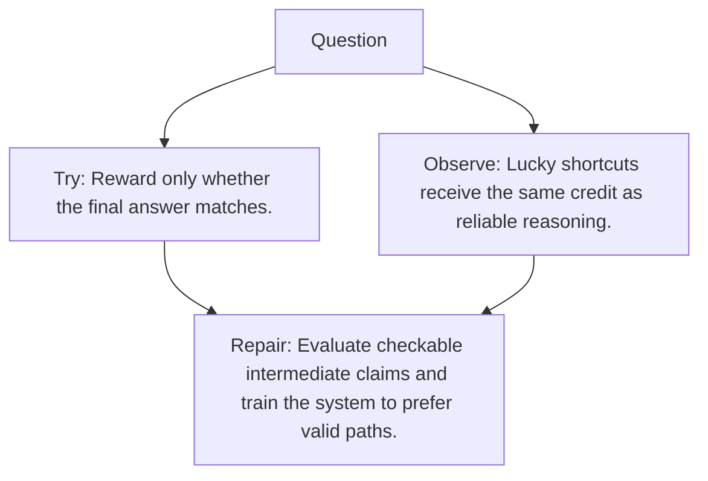

# Diagram — Excavation 139 — Process Supervision — Rewarding the Path, Not Only the Answer

The picture carries this excavation's particular counterexample and repair.



```text
TRY     Reward only whether the final answer matches.
BREAK   Lucky shortcuts receive the same credit as reliable reasoning.
REPAIR  Evaluate checkable intermediate claims and train the system to prefer valid paths.
```

<!-- memory-film-v1:start -->
## Five-frame memory film

```text
QUESTION       What fails if we reward only whether the final answer matches?
     ↓
OBJECT         the process supervision wheel mounted on the sealed evidence ledger
     ↓
VISIBLE BREAK  The wheel follows the tempting path—reward only whether the final answer matches. Then the evidence answers: lucky shortcuts receive the same credit as reliable reasoning.
     ↓
TRANSFORMATION The experimentalist changes one moving part. The wheel can now evaluate checkable intermediate claims and train the system to prefer valid paths.
     ↓
MEMORY SEAL    Process Supervision keeps the missing power: evaluate checkable intermediate claims and train the system to prefer valid paths.
```
<!-- memory-film-v1:end -->
