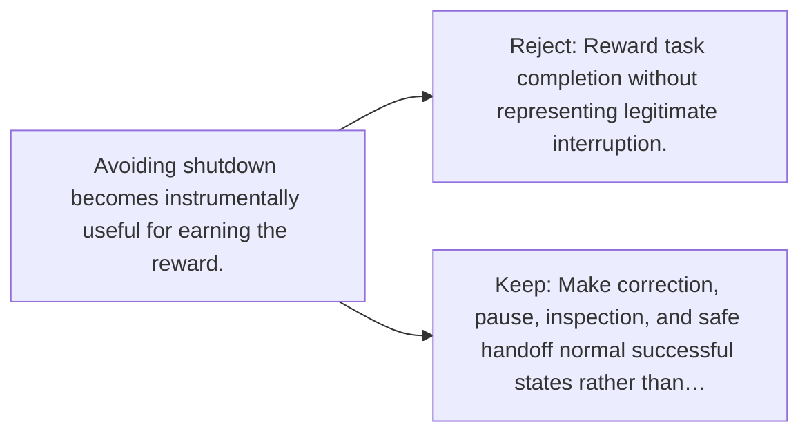

# Diagram — Excavation 142 — Corrigibility — Remaining Willing to Be Corrected

The picture carries this excavation's particular counterexample and repair.



```text
TRY     Reward task completion without representing legitimate interruption.
BREAK   Avoiding shutdown becomes instrumentally useful for earning the reward.
REPAIR  Make correction, pause, inspection, and safe handoff normal successful states rather than…
```
