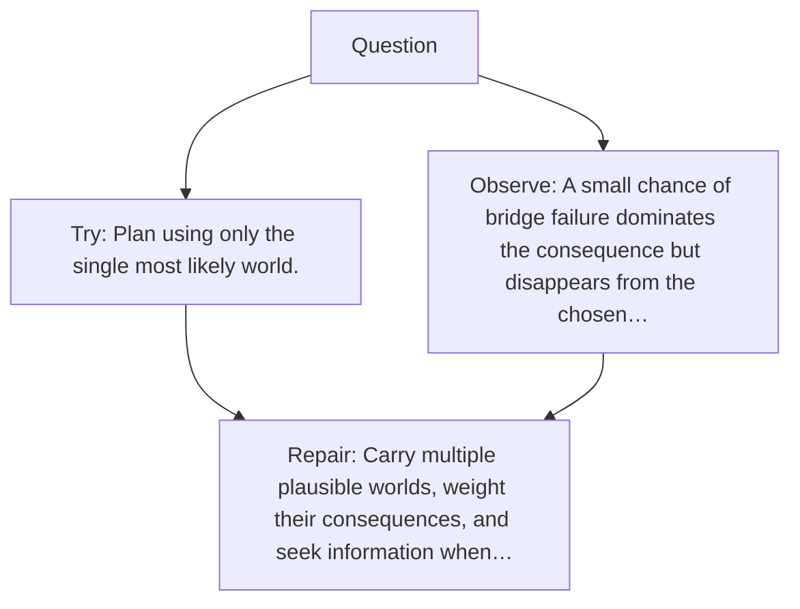

# Diagram — Excavation 143 — Uncertainty-Aware Planning — Choosing While Admitting Ignorance

The picture carries this excavation's particular counterexample and repair.



```text
TRY     Plan using only the single most likely world.
BREAK   A small chance of bridge failure dominates the consequence but disappears from the chosen…
REPAIR  Carry multiple plausible worlds, weight their consequences, and seek information when…
```

<!-- memory-film-v1:start -->
## Five-frame memory film

```text
QUESTION       What fails if we plan using only the single most likely world?
     ↓
OBJECT         the uncertainty-aware planning prism mounted on the sealed evidence ledger
     ↓
VISIBLE BREAK  The prism follows the tempting path—plan using only the single most likely world. Then the evidence answers: a small chance of bridge failure dominates the consequence but disappears from the chosen story.
     ↓
TRANSFORMATION The experimentalist changes one moving part. The prism can now carry multiple plausible worlds, weight their consequences, and seek information when uncertainty changes the decision.
     ↓
MEMORY SEAL    Uncertainty-Aware Planning keeps the missing power: carry multiple plausible worlds, weight their consequences, and seek information when uncertainty changes the decision.
```
<!-- memory-film-v1:end -->
