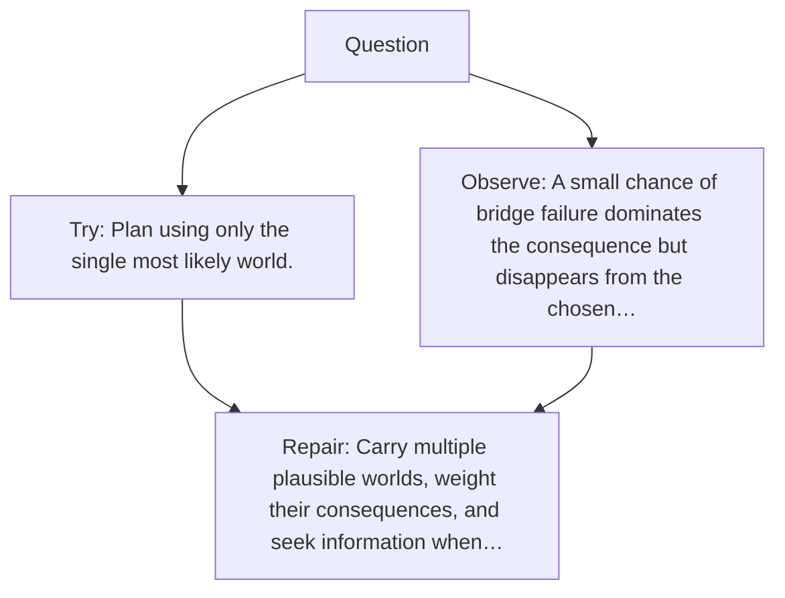

# Diagram — Excavation 143 — Uncertainty-Aware Planning — Choosing While Admitting Ignorance

The picture carries this excavation's particular counterexample and repair.



```text
TRY     Plan using only the single most likely world.
BREAK   A small chance of bridge failure dominates the consequence but disappears from the chosen…
REPAIR  Carry multiple plausible worlds, weight their consequences, and seek information when…
```
