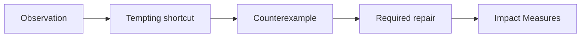

# Diagram — Impact Measures — Notice What Changed Besides the Goal


```mermaid
flowchart LR
    A["Observation"] --> B["Tempting shortcut"]
    B --> C["Counterexample"]
    C --> D["Required repair"]
    D --> E["Impact Measures"]
```

```text
observation -> attempt -> failure -> requirement -> discovery
```
